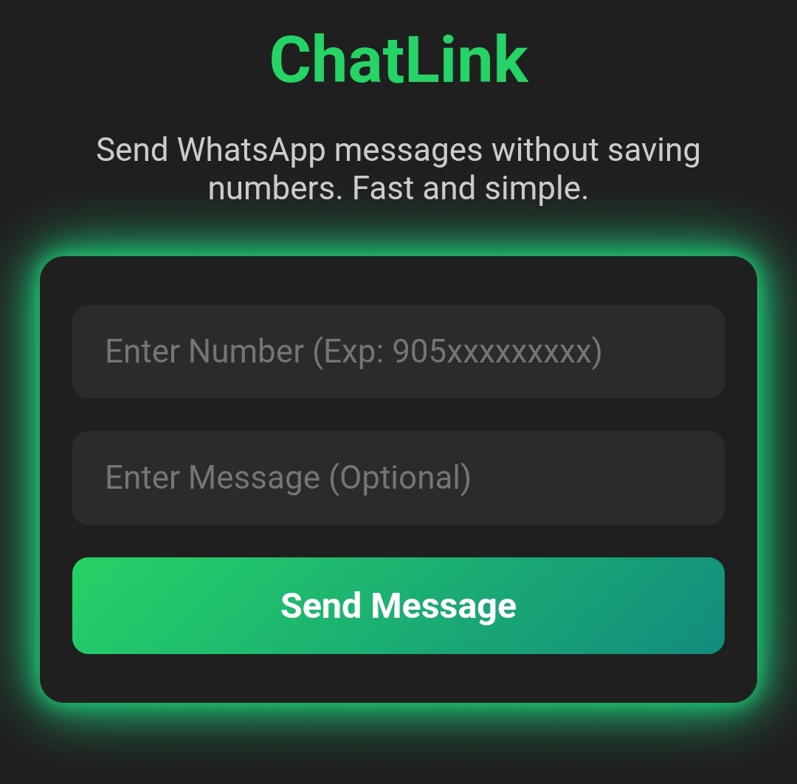

# 💬 ChatLink

**ChatLink** is a lightweight and responsive web app that lets you send WhatsApp messages to unsaved phone numbers — instantly, with or without a message.

---

## 🖼️ Screenshot

---

## 🌍 Features
- 📱 Send messages without saving the number
- ✏️ Optional custom message support
- ⚡ Fast, clean, and mobile-friendly interface
- 🔒 No data stored, everything happens client-side

## 🚀 How to Use
1. Enter the full phone number in international format (e.g., `905xxxxxxxxx`).
2. Optionally, write a message you want to send.
3. Click **"Send Message"** and you'll be redirected to WhatsApp instantly.

## 🧪 Live Demo
> _Coming soon..._

## 📄 License
MIT – free to use, modify, and distribute.

---

# 💬 ChatLink (Türkçe)

**ChatLink**, telefon numarasını rehbere kaydetmeden WhatsApp mesajı göndermeni sağlayan, hafif ve mobil uyumlu bir web uygulamasıdır.

---

## 🖼️ Ekran Görüntüsü

---

## 🌟 Özellikler
- 📱 Kayıt etmeden mesaj gönder
- ✏️ İsteğe bağlı özel mesaj desteği
- ⚡ Hızlı, sade ve mobil uyumlu arayüz
- 🔒 Veriler kaydedilmez, işlem tamamen tarayıcıda gerçekleşir

## 🚀 Nasıl Kullanılır?
1. Uluslararası formatta numarayı gir (örnek: `905xxxxxxxxx`).
2. Dilersen göndermek istediğin mesajı yaz.
3. **"Mesaj At"** butonuna tıkla, anında WhatsApp sohbet ekranına yönlendirilirsin.

## 🧪 Canlı Demo
> _Çok yakında..._

## 📄 Lisans
MIT – kullanmakta, değiştirmekte ve paylaşmakta özgürsün.